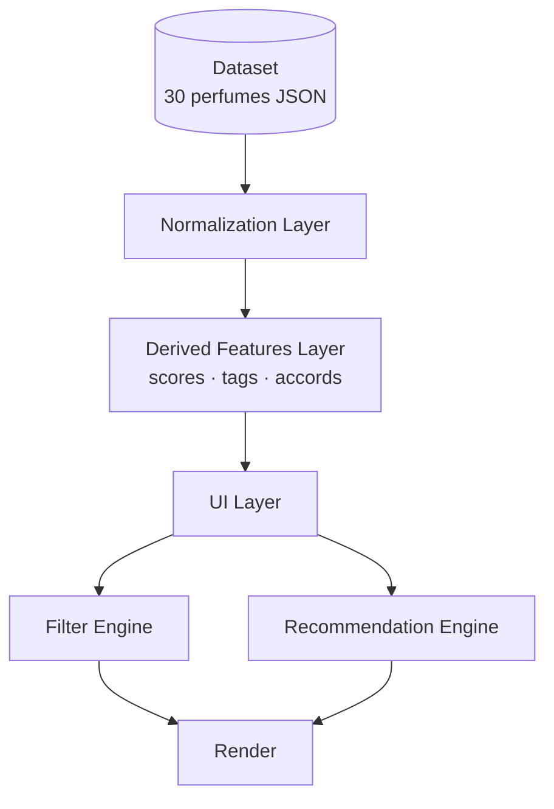
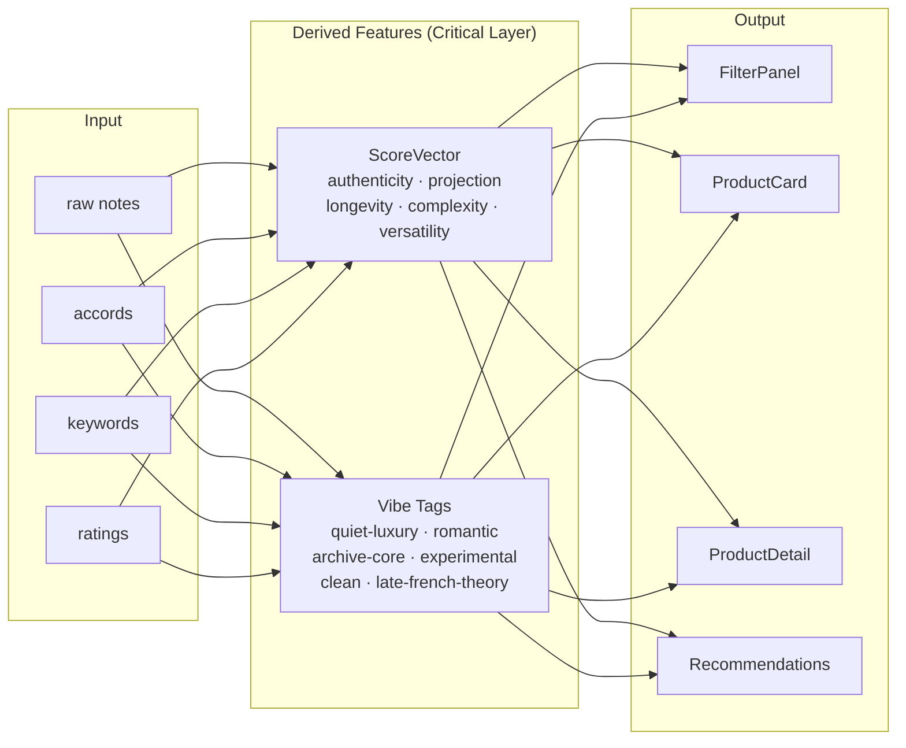
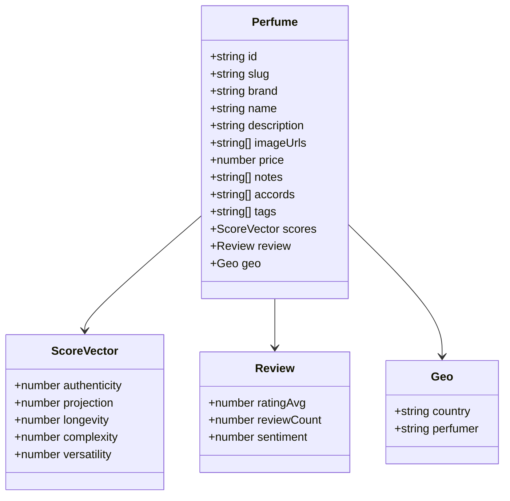
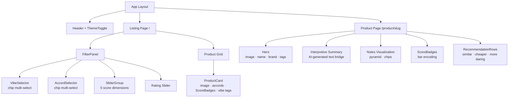
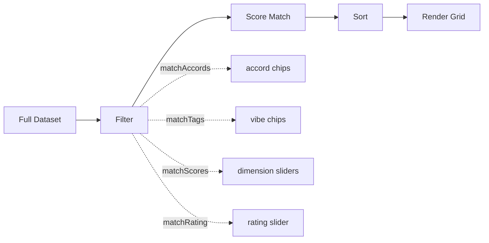
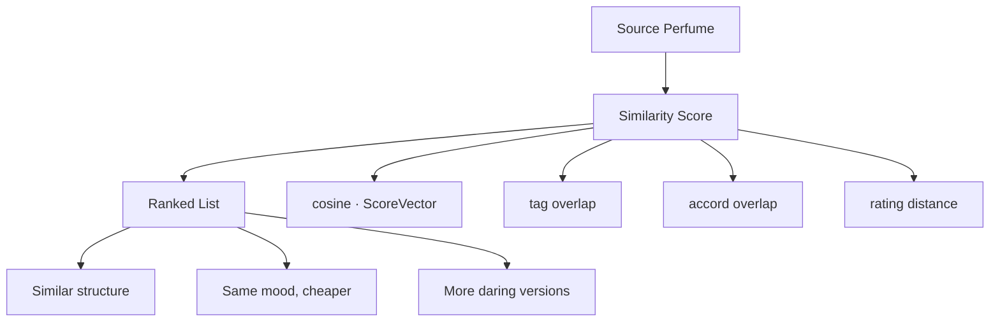
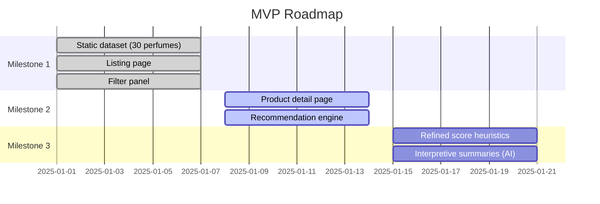

<<<<<<< HEAD
=======
# Scentum

> A taste engine disguised as a shop.

Scentum is not a perfume store. It's a navigable aesthetic space — built to help people explore identity through scent, not just buy a product. Every interaction is interpretive, not transactional.

---

## Architecture



---

## Data Pipeline



---

## Data Model



---

## UI Component Tree



---

## Score Dimensions

Each perfume carries a **ScoreVector** — a 5D perception profile derived from raw data, not editorial opinion.

| Dimension | Heuristic Source | Slider Label |
|---|---|---|
| `authenticity` | natural notes ratio vs synthetic descriptors | Synthetic ↔ Natural |
| `projection` | keywords: "strong", "beast", "skin" | Intimate ↔ Projecting |
| `longevity` | rating data + keywords | Fleeting ↔ Lasting |
| `complexity` | note count + diversity | Simple ↔ Complex |
| `versatility` | sentiment variance + tag spread | Singular ↔ Versatile |

Visual encoding in UI: bars, not numbers.

```
Projection:   ▓▓▓░░
Authenticity: ▓▓▓▓░
Complexity:   ▓▓░░░
```

---

## Filtering Pipeline



All active filters are `AND` conditions — the result space narrows with each selection, giving users a precise multi-dimensional query without ever typing one.

---

## Recommendation Engine



**Similarity formula:**

```
similarity =
  w1 × cosine(scoreVector)
+ w2 × tagOverlap
+ w3 × accordOverlap
+ w4 × ratingDistance
```

Recommendations are contextual — each row has a semantic intent, not just a score.

---

## Vibe Tags

Perfumes are mapped to cultural/aesthetic clusters via accord + keyword heuristics:

| Tag | Heuristic |
|---|---|
| `quiet-luxury` | woody + minimal + understated |
| `romantic` | powdery + iris + floral |
| `archive-core` | retro accords + vintage descriptors |
| `clean` | aquatic + fresh + soap |
| `experimental` | unusual accord combinations |
| `late-french-theory` | abstract + intellectual + niche |

---

## Tech Stack

| Layer | Technology |
|---|---|
| Framework | Next.js 15 (App Router) |
| Language | TypeScript 5 |
| Styling | Tailwind CSS 3 |
| Components | shadcn/ui + Base UI React |
| Icons | Lucide React |
| Package Manager | Bun |

---

## Milestones



---

## Design Principles

**Interpretive over factual** — raw data becomes meaningful axes.

**Multidimensional taste** — no single score, everything is a vector space of perception.

**Familiar shell, new soul** — e-commerce layout with semantic filters underneath.

**Legible intelligence** — users should always feel: *"I understand why this is recommended."*

---

> The real product is the **translation layer between data and perception** — turning structured perfume data into a navigable aesthetic space.
>>>>>>> abde63d (first commit)
# ux-ai-scentum
